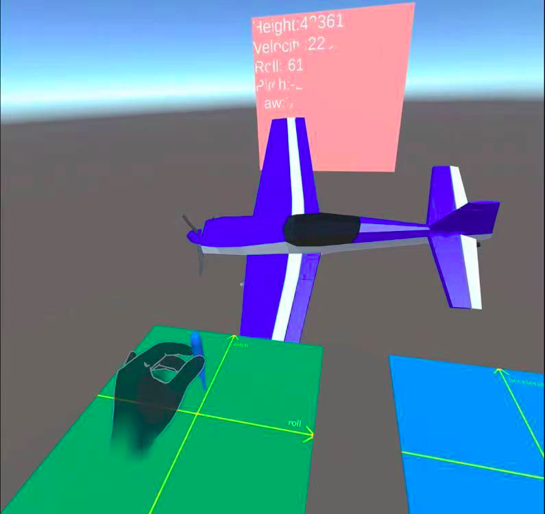

# 结题报告

## 小组成员和项目分工

徐亦昶：Oculus应用开发的主要调研，基础系统界面以及系统完整功能的设计以及编写。点击手势的实现。
徐笑阳：远程桌面实现的调研，调研unity photon，远程桌面的设计以及代码实现。
吕泽龙：远程桌面实现的调研，调研unity photon，远程桌面的设计以及代码实现。
王铖潇：Oculus手势交互的调研，无人机监控app的实现。PPT制作和报告编写。
阮继萱：Oculus手势交互的调研，无人机监控app的实现。PPT制作和报告编写。

## 选题背景和研究意义

VR发展趋势到现在，早已被愈来愈多的人所熟识，但是提到VR行业，绝大多数人对于此事的印像将会还滞留在它是一种有意思的游戏感受上。现阶段VR技术以其交互性、感知性和趣味性等特点，早已普遍的运用于诸多如城市规划建设，工业仿真，名胜古迹还原等诸多领域。

- 交互性

  它具有超强的仿真系统，真正实现了人机交互，使人在操作过程中，可以随意操作并且得到环境最真实的反馈。

- 感知性

  用户可以在虚拟现实世界体验到最真实的感受，其模拟环境的真实性与现实世界难辨真假，让人有种身临其境的感觉。

- 趣味性

  具有一定的趣味性，人们可以任意切换自己所处的场景，并在其中得到一定乐趣。

但是当前相关的一些应用也存在缺陷，比如：

- 不支持XR直观上对远程设备的控制

  无法通过XR直接远程控制特定的电脑屏幕并对其进行操纵。

- XR与现实的连接太少

  当前XR应用主要集中在游戏，很少有利用混合现实技术来对真实物理世界进行操控。

- 交互方式不够灵活

  使用手柄交互，可支持动作太少，或使用 handtracking 但没有充分利用其便捷性，导致手势跟踪还不如手柄操作方便。

因此，我们希望对此类应用进行更深入的研究开发，使其更好地应用到实际场景中，发挥更大的作用。

## 研究思路与研究方法

### 远程控制

首先，通过一个菜单界面进入IP以及端口设置板块，输入IP地址和端口后即可连接特定设备。然后可以进行传输，在传输过程中使用UDP传输视频数据，并且通过对数据进行编解码的方式降低延时。通过手触摸屏幕以及虚拟键盘对其进行控制，可以进行和个人电脑上相同的一系列操作。另外，屏幕背面支持文件传输，可以将不同主机的文件互相传输，不同主机可以共享剪切板，实现多设备交互。

### 手势识别

1.  首先我们调研了unity自带的Asset包裹里面的几个手势样例，比如抓取、点击以及拖拽等。
2.  我们建立我们自己的模型，仿照了其原有的样例，在模块上面附上脚本，从而实现对于不同手势的识别，而后我们使得界面对于相应的识别有着相应的回应，这些都是在模块脚本里面实现的。

3.  为了消除抖动，借鉴了计组课上的按钮消抖动的方法，从而使得我们的手势识别更为稳定。

### 无人机APP

1. 利用3D画图软件将飞机模型以及控制面板与控制棒绘制出来。

2. 将控制棒的相对位置通过对应的公式计算出对应的飞机角度并通过对飞机的侧翼以及尾翼的下压和抬升控制翻滚角、俯仰角以及飞机速度。

3. 在飞机模型的控制脚本里面加入socket通信，使其实现数据的传送，此时我们的另一个接收端是模拟了真实的飞机情形，在接收到数据后假设其会根据数据改变自身行为，并将自己的当前状态传输回去。

### 文件共享

1. 根据相应的文件服务器IP、端口来复制到目标文件。

2. 为服务器新增一个线程，在一个不同的 TCP 端口启动文件服务线程。

3. 为了方便传输，我们通过UTF-8进行编解码。

4. 对于普通文件以及文件夹，我们都是使用标识符进行传输，但是我们在文件夹中我们采取了递归传输的方式。

5. 当所有文件发送结束的时候，服务器也会发送一个终止标识符并终止会话。

### 绘图

1. 主要是调用了unity中的Gizmos和Handles这两个库。

2. 在MonoBehaviour的脚本的OnDrawGizmos()和OnDrawGizmosSelected()中使用。

3. 设置一个可以调节半径的Handle，从而方便操作者对于范围的选取。

## 关键技术和实践难点

### 难以找到合适的手势操作模板

#### 困难

下载了一些相关资源，但其中的手势操作有很大问题，具体表现为：按钮碰撞后直接点击，容易误触；太过复杂，不适合开发大应用，等等。

#### 解决方案

* 找到合适的SDK：使用oculus integration SDK，该技术由oculus开发，较为稳定。
* 手写UI：仅参考SDK的示例demo，手写易复用的控件。

### OBJ导入过程繁琐

#### 困难

由.obj转化成mesh特别麻烦，同时还要考虑贴图和颜色透明度，需要具备一定的计算机图形学知识。

#### 解决方案

查阅了许多的资料，硬写！

### 远程控制相关

#### 困难

* 尝试过直接用ffmpeg，由于屏幕分辨率较高，传输特别慢。
* 抖动严重，可能触摸一下屏幕会触发多次点击操作。
* 多种操作容易混淆：比如如何区分点击和拖拽？
* Oculus integration SDK无法检测点击位置。
* 文件传输不方便、不安全。

#### 解决方案

* 使用视频编解码：用gzip，async等技术自己编写，最终延时比网上下载的VNC轮子还要低。
* 借鉴verylog按钮思路去抖动：使用计时器，只有退出一段时间并不再进入时才判定为松开左键。
* 规定长按1.5秒才算是拖拽。
* 自己写点击检测：不使用SDK，直接用碰撞箱，当手指间的碰撞体和屏幕接触时检测接触点坐标。
* 使用自行设计的信息传输协议：针对稳定的链接与固定的操作，使用自行设计的简单控制协议。

### 文件共享的发送协议

#### 文件

文件的话主要是由一个起始标志符、一个文件名还有文件正文的字节流组成，主要是通过socket发送。

#### 文件夹

在与文件的发送形式相似的情形下，我们在其中先是发送了一个文件夹名字，而后则是将文件采用递归的形式进行发送。

## 研究成果

### 实现了远程的桌面控制

可以通过在系统的键盘输入相应的IP地址以及相应的端口号，从而实现控制对应的电子设备。我们在使用远程控制的时候，对于对应电子设备的控制也可以是使用我们的手势动作来实现。就比如说我们可以用手点击虚拟屏幕从而来锁定当前屏幕，并且可以点击屏幕里面的相关按键来实现现实世界中相对应的功能。

相比于以往的Oculus Quest2的功能，我们的设计添加了远程的控制功能，并有望将单个设备远程控制拓展到多个设备交互的远程控制，这便利了我们对于设备的使用。

### 实现了物体的手势抓取以及点击

可以在我们自己设计并编写完成的系统界面里面实现基本的点击，可以做到和现实中一样的视觉效果。与此同时，点击过程中，手势识别对于使用者的点击速度以及点击的各种形态有着很好的兼容性与普遍性，与原先使用手柄相比，极大地提高了其便利性以及交互性，并且给使用者带来了一定的趣味性。就如同我们在智能手机上可以通过滑动点击等方式控制软件一样，我们在Oculus这个VR设备中也实现了与之功能相似的手势功能，并且同手机等设备相比，我们实现了从2D到3D的巨大突破，特别是其中的抓取功能，是我们在3D方面所实现的一个亮点。

如下，我们在此处模拟了一个菜单界面，我们只需通过点击其中的Remote Desktop键就可以进入远程连接功能，就不再需要原先的手柄来作为媒介了。

再者，如同以下这个心脏模型，我们可以通过直接抓取其中的组织部件，从而移动进行查看。这种场景就可以很好地应用到医疗领域。同原先使用手柄相比，医生使用手势直接抓取更加具有真实性。

### 实现了一个无人机监控的APP模拟

我们首先实现了一个基本的飞机模型的设计，其中包含了飞机的侧翼、尾翼以及飞机的主体部分。我们通过对于飞机部件的位置以及行为的改变从而来对飞机的速度、方向还有翻滚角来进行改变，这使得我们的飞机模拟事件同真实的飞机飞行更为相像，直接导致了我们模拟数据更具有说服力。

与此同时，我们实现了一个飞机的控制面板以及控制棒，这使得我们可以通过滑动控制棒来实现飞机的翻转以及方向和速度调整。之后我们还成功地将飞机的各种位置参数以及其角度发送至了客户端，从而实现了对于飞机的监测和控制。

### 实现了文件共享

我们可以实现在屏幕背面进行文件传输的工作，我们是根据相应的IP以及端口号对应到相应的文件以及目标复制文件的server，从而实现文件在两个设备之间的转移，这在未来的办公场景中可以极大地放大我们的工作效率。

### 绘图功能

我们的绘图功能实现了可以在3D的环境下面进行绘图，不同于以往的2D场景以及依靠手柄作为媒介，我们的绘图功能更加的具有立体效果并且更为灵活便利。我们在场景中还可以进行移动从而来看到我们所制作的立体图片的各个角度，这种功能可以很好地运用在教学领域以及医疗领域。

## 我们的优势

### 沉浸式操控3D模型，增强了空间感知

* 目前没有VR应用做到这一点。
* 应用：教学行业，另外一个应用是VR的CT阅片端（目前该功能已被一公司签约）。

### 提供了使用VR远程交互的技术，突破速率限制

* Gzip+Asnyc encoding
* VR端具有可行性高的控制方式（屏幕点击去抖动、按键不容易出错）。以往项目中VR端的控制极易引起操作失误，效率远低于PC端。 

### 摆脱手柄，使用方便

* 使用手直接对虚拟物体操作更自然，未来容易改为AR应用。
* 无需反复拿起放下手柄，仅需头盔即可完成全部操作。

### 论证了使用VR技术实时监控的可行性

* 在远程终端模拟了一个无人机进行验证。
* VR端实时显示无人机的各种信息。

## 应用前景

### 用于对空间感要求很高的应用

* 比如中学立体几何教学。
* VR的CT阅片端。

### 可以发展成为成熟的沉浸式远程控制系统

* 不存在传输效率问题，可以多屏幕同时控制，文件实时传输。
* 核心部分兼容性高，控制终端支持多种系统。

### 发展成为纯手势交互的轻量化VR设备

* 原有的眼镜变轻，使得用户的体验感变好。

### 类似与劳斯莱斯无人船，方便地对远程设备操控

* 可以及时、直观看到设备信息。

## 不足与展望

### 手势的检测有抖动

我们对于手势识别的灵活度和流畅度还有待提升，比如在点击时，可能会由于手指在同一个位置停留时间过长，导致将点击识别为拖拽的情形。并且，其对于手指弯曲的识别有一定的延迟，有的时候会导致手指点击位置的不精确。

### 未实现多人模式

我们目前实现了单设备模式的远程控制，尚未实现多设备的交互控制。未来我们有计划会将单设备控制拓展为多设备控制，并且使用简单的拖拽等手势来实现设备的远程控制。

### 没有将无人机真实映射到物理世界中

我们由于条件的有限，未能将无人机的程序代码部署到真实物体上，而只是通过unity中模型的模拟来验证了我们对无人机控制以及监控这一事件的可行性。未来，我们计划将这一监控app部署到真实的无人机上，从而让我们的控制面板和控制棒来实现真正意义上的物理控制。

