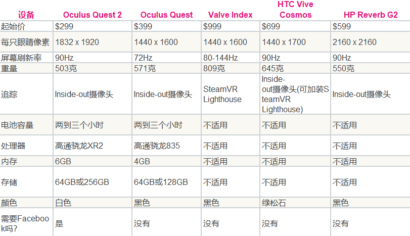
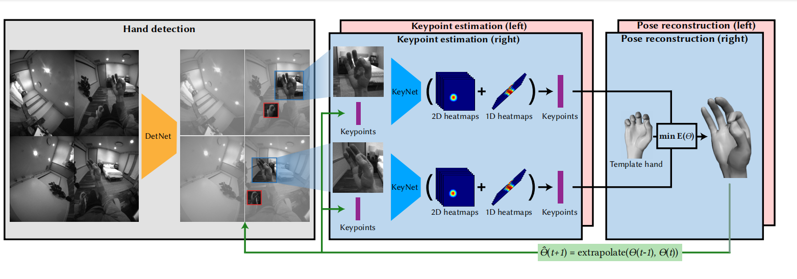
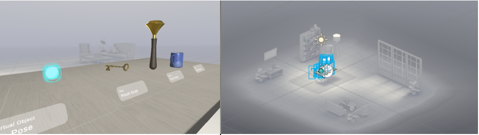
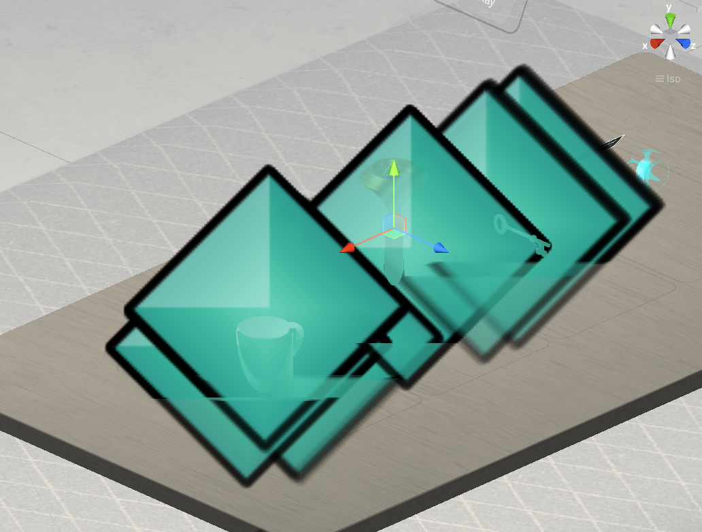

# 调研报告

## 组员分工

### 调研阶段
**Phase 1**  

* 徐亦昶、阮继萱、王铖潇：Oculus应用的开发，主要是手势交互  
* 徐笑阳、吕泽龙：远程桌面的实现

**Phase 2**  
* 徐亦昶：基础系统界面及系统完整功能的设计，设计一种文件类型，可以方便定义可交互3D模型。协助徐笑阳、吕泽龙调研文件系统  
* 徐笑阳、吕泽龙：根据需求**设计**文件系统，可以调研调研wsl的文件系统是怎么实现的，以及unity如何和这样的文件系统进行交互（收集资料，不一定写Demo）。文件系统需要和外界方便得交互，如支持外部上传文件。  
* 阮继萱、王铖潇：根据之前的调研结果，设计用户级应用程序。

**Phase 3**  
* 徐亦昶、阮继萱、王铖潇：在之前的手势交互中，似乎没有调研出来如何获取具体点击的位置（虽然按钮知道被点击），继续调研看能不能克服这一点。  
* 徐笑阳、吕泽龙：调研unity photon  

### 编写阶段 
**Phase 1**  
* 徐亦昶、徐笑阳、吕泽龙写出基本的系统界面，包括基本的系统应用，如屏幕共享和可交互模型的打开。屏幕共享不要求文件传输，但要留相关入口方便后续开发。  
* 阮继萱、王铖潇：编写用于扩展系统边界的独立APP，比如无人机监视及控制。 

**Phase 2**  

* 徐亦昶、阮继萱、王铖潇：为屏幕共享写文件传输窗口（一种设计：原来窗口旋转180度即为文件管理器）  
* 徐笑阳、吕泽龙：使用photon将程序改为多人协作模式  

**Phase 3**  

* 将phase2的单人成品和多人半成品整合

## 概述
### 定义
这是一个基于oculus的3D环绕式办公应用，采用handtracking，像在真实世界中对控件和模型进行交互。
### 意义
* 易用性：直接用手进行交互，尽可能模拟真实物理世界的交互行为，使交互更灵活。
* 办公的并行性：多应用3D环绕，可以同时且直观地对多种设备进行监视。
* 可扩展性：设计一种简单的脚本语言来记录3D可交互模型的信息，这类模型可以随时载入成为系统中的应用。
* 支持多人合作办公。

### 背景
* Virtual Desktop：VR虚拟桌面，但仅支持一台计算机的连接，且无法便捷传输文件。  
* Oculus自带桌面：采用pinch作为点击信号，光标特别难操纵，而且pinch识别很不灵敏，效率极低。
* Oculus handtracking games：没有实用性，且使用手柄代替手效果会更好。
* Hand Physics Lab：一个可以使用手进行操控的简易实验平台，但仍然没有什么适用性，另外作为一款单独的APP，无法对其进行扩展。
* 目前并未调研到oculus的任何正式的办公应用，以及使用VR技术控制真实模型。
### 需要考虑的问题
* 远程连接流畅度要尽可能高，需要考虑到多终端。
* 手势应该尽可能简化，尽量不要创造有特殊意义的手势。
* 系统结构应该模块化，以便于个性化修改。
### 我们大作业目前的具体实施路线
* 分别调研项目涉及到的关键点。
* 完成系统基础界面的搭建。
* 不断完善系统应用。
* 设计用户级应用程序。
* 改进项目，支持多人协作。

## Oculus 

### 背景

Oculus Rift是释放市场的早期和最着名的VR耳机之一。 基于立体VR的概念，每只眼睛接收图像和两个给出VR的错觉，Oculus Rift具有各种开发套件和预释放模型。Oculus Rift是释放市场的早期和最着名的VR耳机之一。 基于立体VR的概念，每只眼睛接收图像和两个给出VR的错觉，Oculus Rift具有各种开发套件和预释放模型。截至目前，Oculus总共推出两代产品，分别是OculusRift以及最新的OculusRiftDK2，和前一代产品相比，DK2在屏幕分辨率、追踪器上有了较为明显的提升。

该系统的早期版本主要是独立和实验性的，但在Facebook的巨大投资之后，更多的主流出版商已经跳过船上为Oculus Rift创造独特的体验。 同时，公司的Oculus进一步投资于VR技术 - 例如，三星齿轮VR本身由Oculus技术提供动力。

虚拟现实技术囊括计算机、电子信息、仿真技术，其基本实现方式是计算机模拟虚拟环境从而给人以环境沉浸感。从理论上来讲，虚拟现实技术（VR）是一种可以创建和体验虚拟世界的计算机仿真系统，它利用计算机生成一种模拟环境，使用户沉浸到该环境中。虚拟现实技术就是利用现实生活中的数据，通过计算机技术产生的电子信号，将其与各种输出设备结合使其转化为能够让人们感受到的现象，这些现象可以是现实中真真切切的物体，也可以是我们肉眼所看不到的物质，通过三维模型表现出来。因为这些现象不是我们直接所能看到的，而是通过计算机技术模拟出来的现实中的世界，故称为虚拟现实。

虚拟现实技术受到了越来越多人的认可，用户可以在虚拟现实世界体验到最真实的感受，其模拟环境的真实性与现实世界难辨真假，让人有种身临其境的感觉；同时，虚拟现实具有一切人类所拥有的感知功能，比如听觉、视觉、触觉、味觉、嗅觉等感知系统；最后，它具有超强的仿真系统，真正实现了人机交互，使人在操作过程中，可以随意操作并且得到环境最真实的反馈。正是虚拟现实技术的存在性、多感知性、交互性等特征使它受到了许多人的喜爱。

作为一个新的计算平台，VR/AR仍在试验各种输入模式，包括鼠标和键盘、游戏控制器、6个自由度(DOF)运动控制器和可穿戴手套。基于视觉的手动跟踪可能可以比这些外设提供更方便和更低摩擦的输入。例如，用户可能不需要携带或收取额外的设备，或佩戴可穿戴设备。然而，要成为一种真正方便的输入方式，手势跟踪还必须对环境和用户的变化具有鲁棒性，支持更大的工作量，并产生响应迅速的和用于定位和选择的精确（低抖动）运动。作为 VR/AR耳机的移动性越来越强，手势跟踪输入系统必须也可在低计算预算下运行。

互联网已经从PC时代进化到移动互联网时代，未来虚拟现实设备很有可能成为下一个入口。

### 优势

首先可以看一下下面这张图,我们可以发现其在价格，重量以及追踪存储方面都有着极大的优势，可以说虽然Oculus虽然并不完美，但是可以算的上是目前最为优秀的VR一体机，而且其提供的开发者模式下的Oculus Integration SDK可以提供给开发者一定程度上的便利性，同时也是初步开发者们了解其基本的一些操作模拟的原理的良好通道。

### 其采取的手势追踪识别的一些方法

* 采用了当下流行的RGB相机。
* 基于神经网络学习。
* 采取多视图捕获系统。（其使用四个Egentric单声道Chrome Fisheye相机来生产3D手姿势估计）
* 使用轻量级数据col的高质量标签进行了最小的手动注释。
* 其利用跟踪历史，从而改善了时间跨框架的平滑度和MUL Tiple Piews的空间一致性。

注：上图是其在手势识别以及追踪上的一张示例图。

## Oculus integration SDK

### Oculus Integration SDK介绍

Oculus里面的Interaction SDK Experimental 是一个模块化、可组合的组件库，允许开发人员为控制器和手势实现一系列强大的标准化交互（包括抓取，松开和捏住以及投射等）。 交互式 SDK 还包括帮助开发人员构建自己的手势的工具。其目前支持Oculus Quest 以及Quest2这两款设备，相关支持的Unity为2020.3以及2019.4这两个版本。（值得注意的是，手部追踪目前存在一些问题，比如双手互相遮挡时可能会带来追踪丢失）

### Oculus Integration SDK使用（Handtracking创建）

其使用场景大致如下，其中我们可以看到左上角的Hierarchy模块，它是设计游戏界面的主要场所，下方的Project则是之前从Unity asset store中下载下来的integration sdk，右侧的Inspector就是对于当前模块以及脚本的一些阐述。在Oculus Project里面已经有许多提供给开发者使用的模块以及脚本，就比如说下图中的OVRCameraRig，其中有左右手的一些动作模拟，我们此时可以从Prefab文件夹中找寻到对应的脚本，然后将其放置于对应的子模块下面后调解好参数，点击display键就可以有初步的动画效果。总之基本步骤如下（以OVRCameraRig为示例）：

* 先是将OVRCameraRig在Project中搜索到，然后拖至上方Hierachy中。
* 然后搜索OVRHandPrefab然后分别将其拖至RightHandAnchor以及LeftHandAnchor下面。
* 将Right目录下的Hand Type、Skeleton Type、Mesh Type调整置Hand Right。
* 之后在目录下搜索到OVRControllerPrefab，将其拖至LeftControllerAnchor和RightControllerAnchor下。
* 将其中的Controller参数从Mixed分别改成R Touch和L Touch。
* 最后点击运行键，然后就可以了。

### Oculus Integration的重要文件夹功能说明

#### Oculus/Interaction/Sample/Scenes

这个文件夹下包括了Basic Grab、Complex Grab、Basic Ray、Direct Touch、Pose Detection等相关动作读取的unity文件。

##### Basic Grab

- 虚拟对象可以有简单的捏合抓取以及基于手的卷曲的抓取（具有一定的旋转对称性）。
- 具有多个捏合和手掌抓取功能，可与相关的手抓姿势相互作用。
- 可以实现在抓取过程中某些关节上的手指自由。
- 所有物品都允许在双手之间转移。

注：上图为basic grab的测试过程图以及初始场景图。

##### Complex Grab

* 可以满足具有平面约束并仅平移可抓取对象。
* 可以满足用双手捡起、投掷、变换和缩放的物理对象。
* 可以满足具有约束的单手旋转变换。

##### Basic Ray

- Ray 与 Unity 画布具有交互。
- 手部交互使用系统指针姿势和捏合进行选择。
- 光线交互使用控制器姿势利用光线方向和触发器进行选择。
- 允许各种材质类型的曲面：Alpha 切口、Alpha Blended 和 Underlay（仅在设备上可见）

##### Direct Touch

- 使用独立按钮或 Unity 画布戳交互和按下按钮来实现触碰。
- 戳痕是通过对基于盒子的邻近场进行光线投射来检测的。
- 演示了多种视觉效果，包括各种按钮深度以及用于按钮悬停状态的“触摸悬停”和“悬停在上面”变体。
- 触摸限制要求使手保持在按钮表面上方。
- 带有多个戳交互器的大按钮（可以使用手侧，手掌进行按戳）。
- 弯曲和扁平的 Unity 画布，带有触摸限制滚动和按钮。

##### Pose Direction

- 有多个手部姿势的姿势检测：竖起大拇指、竖起大拇指、岩石、纸张、剪刀和停止。
- 姿势可以由左手或右手触发。
- 停止演示要求手与姿势处于触发器中。
- 在姿势开始时触发粒子效果。
- 在姿势结束时隐藏粒子效果。

注：上图即为其对于竖大拇指的识别。

### 一些原理上的理解

经过基本对脚本的阅读，首先可以发现其基本是使用C sharp编写完成，经过对于C sharp一定的学习目前可以发现Oculus内部的脚本基本上是采用Oculus相机控制器，并在每帧期间根据观看方向生成光线，然后检测光线在对应的3D物块上的碰撞。每个物体都由一个几何形的立体图形所包裹，Oculus的摄像头通过对于光线碰撞的捕捉来判断我们当前的动作，从而将其模拟出来。

就如同下图中的火炬，杯子以及钥匙，它们就由分别的立方体包裹起来，而后当我们对他们进行抓取时在每一帧观察光线的碰撞变化，从而实现对于该动作的识别，然后再具体映射到对应的虚拟物体上，从而实现基本的抓取。其中摄像头捕捉到的具体值经过处理以后可以在windows/analysis/XR Interaction Debugger中查看，然后脚本会根据其中的boolen值来进行动作的判断。

## 注
这里提到的“动态3D模型”指支持隐藏/显示各个部件，平移、旋转、缩放整个模型，有限制地平移、旋转、缩放各个部件，以及显示各部件体积等详细信息的简单模型。可以用一个类似于3DaaS的文件，以xml的形式定义这些信息。作为一个应用场合，这可以用于CT影像的分析。加载动态模型属于系统应用，而和真实物理世界对应、可控制的3D模型是用户级应用程序，它的功能要比“动态3D模型”多得多。
## 设想结果
* 手掌张开出现系统菜单，包括远程连接、动态模型导入。
* 空间中可能出现一些虚拟按钮，可以像在物理世界中一样进行点击。
* 手像正常刚体一样，可以任意控制刚体模型。
* 远程连接中，每连到一个终端面前多一个屏幕，可以用手抓着屏幕移动它的位置，屏幕的正面是远程机的屏幕，背面是文件系统。每次单击屏幕时将屏幕激活，远程剪切板设为系统剪切板，focus离开时系统剪切板更新为远程的剪切板，这样支持快捷的复制。在背面，可以直接把文件拿起，放到另一个文件的背面实现文件的复制，或放到下面出现的垃圾桶删除文件。
* 可以导入obj模型，并对其进行交互。
* 可以从电脑上把动态3D模型导入oculus。
* 实时检测并控制3D模型。
* 房间内可以出现多个人协作作业。

## Remote Desktop
本项目中，在实现Oculus系统的过程中，需要实现的功能之一就是远程连接终端，并且对用户展示实时交互的桌面UI界面，并且根据用户的指令和需求进行文件的端对端传输，并在可能的范围进行一些多人协作作业。这就需要一个快速而有效的远程桌面控制框架。这无疑是一个巨大的工程。索性，这项技术已经被多个开源项目实现，下面介绍一些可用的远程桌面开源框架。
### 基于视频流技术的多平台远程桌面控制框架
实现远程桌面的控制，要提供一个简洁，完整的UI界面，一个自然的想法是记录、转换远程连接桌面的数字音频和屏幕映像并传输到控制端进行显示。事实上，有很多技术可以实现这一功能，比如著名的ffmpeg，甚至windows官方提供的MSTSC都是基于数字多媒体信息的流转化传输解码。下面提供两个比较完备且看上去可移植性较高的开源框架。
#### rustdesk

这是一款开箱即用的远程桌面软件，覆盖了几乎所有常用的平台如linux，windows，mac，安卓。有一个用户友好的UI界面，支持文件传输。全部使用rust语言，并且代码目录下有介绍文件结构和实现思路，代码功能，有较好的可移植性。
#### freerdp

另一款开源的远程桌面软件是freerdp，采用的语言较多，实现的功能应该和rustdesk是类似的，在此不多做赘述了。