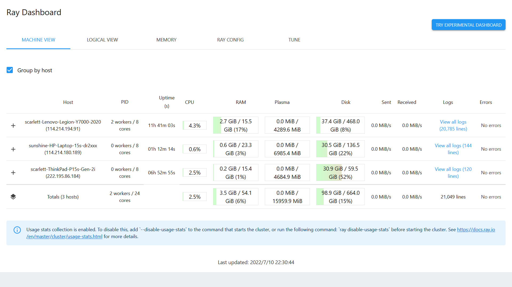

# Ray 部署说明文档

本文发布在 [](https://zhuanlan.zhihu.com/p/539972688)

## 基于 Docker 的部署

### 跨平台基于桥接网络部署

因为 Windows 与 MacOS 不能直接安装 Docker Server，即使直接安装 Docker Engine，其本质也是先装虚拟机再安装 Docker，所以 Windows 与 MacOS 中的 Docker 不能与主机共享网卡配置，只能使用桥接 + 端口映射的方式。因为大量映射端口会在启动 Docker 的时候产生不小的开销，而且可能有的端口被占用，所以本文将映射大约 100 个端口，并将其指定给 Ray 的各端口。

#### Head 结点部署

1. 按照官网提示安装 [Docker Desktop](https://docs.docker.com/desktop/)
   
1. 通过以下命令启动 Docker：
   
   ```powershell
   # Powershell - Windows
   md $HOME'\tmp\ray'
   docker run -itp 8265:8265 -p 6379:6379 -p 10001-10099:10001-10099 -p 20000-20007:20000-20007 --shm-size=8gb -v $HOME'\tmp\ray:/tmp/ray' 'rayproject/ray-ml'
   ```
   
   ```bash
   # Bash - MacOS
   mkdir -p ~/tmp/ray
   docker run -itp 8265:8265 -p 6379:6379 -p 10001-10099:10001-10099 -p 20000-20007:20000-20007 --shm-size=8gb -v ~/tmp/ray:/tmp/ray 'rayproject/ray-ml'
   ```
   
3. 通过以下命令启动 Ray 的 Head 结点：
   
   ```bash
   ray start --head --max-worker-port=10099 --node-manager-port=20000 --object-manager-port=20001 --dashboard-host="0.0.0.0" --redis-shard-ports=20002,20003,20004,20005,20006,20007 --node-ip-address='ip.of.your.host'
   ```

配置完成后，用户根目录下的 `tmp/ray` 目录是存放日志的目录。

#### Worker 结点部署

1. 按照官网提示安装 [Docker Desktop](https://docs.docker.com/desktop/)

1. 通过以下命令启动 Docker：
   
   ```powershell
   # Powershell - Windows
   md $HOME'\tmp\ray'
   docker run -itp 8265:8265 -p 6379:6379 -p 10001-10099:10001-10099 -p 20000-20001:20000-20001 --shm-size=8gb -v $HOME'\tmp\ray:/tmp/ray' 'rayproject/ray-ml'
   ```
   
   ```bash
   # Bash - MacOS
   mkdir -p ~/tmp/ray
   docker run -itp 8265:8265 -p 6379:6379 -p 10001-10099:10001-10099 -p 20000-20001:20000-20001 --shm-size=8gb -v ~/tmp/ray:/tmp/ray 'rayproject/ray-ml'
   ```

2. 通过以下命令启动 Ray 的 Worker 结点：

   ```bash
   ray start --address='url.of.head.node:6379' --max-worker-port=10099 --node-manager-port=20000 --object-manager-port=20001 --node-ip-address='ip.of.your.host'
   ```

配置完成后，宿主机用户根目录下的 `tmp/ray` 目录是存放日志的目录。

### Linux 环境下基于宿主机共享网络配置的部署

在 Linux 环境中，如果直接安装 Docker Engine，那么容器可以通过某些选项与宿主机共享网络配置，所以可以通过以下方式来简便部署：

#### Head 结点部署

1. 按照官网提示安装 [Docker Engine](https://docs.docker.com/engine/install/)

2. 通过以下命令启动 Docker：

   ```bash
   mkdir -p /tmp/ray
   sudo docker run -itv /tmp/ray:/tmp/ray --shm-size=8gb --network=host rayproject/ray-ml
   ```

3. 通过以下命令启动 Ray 的 Head 结点：

   ```bash
   ray start --head --dashboard-host=0.0.0.0
   ```

配置完成后，宿主机的 TCP 80 端口即为 Dashboard，`/tmp/ray` 目录是存放日志的目录。

#### Worker 结点部署

1. 按照官网提示安装 [Docker Engine](https://docs.docker.com/engine/install/)

2. 通过以下命令启动 Docker：

   ```bash
   mkdir -p /tmp/ray
   sudo docker run -itv /tmp/ray:/tmp/ray --shm-size=8gb --network=host rayproject/ray-ml
   ```

3. 通过以下命令启动 Ray 的 Head 结点：

   ```bash
   ray start --address="url.of.head.node:6379"
   ```

配置完成后，宿主机的 `/tmp/ray` 目录是存放日志的目录。

## 跨平台直接部署

为了和官方 Docker 容器兼容，我们需要为 Ray 安装特定的 Python 与各个库版本。为了不与本机的其他 Python 版本冲突，我们将使用包管理工具 Conda 协助部署。

1. 按照官网提示安装 [Miniconda3](https://docs.conda.io/en/latest/miniconda.html)

2. 创建名为 `ray` 的新虚拟环境：

   ```bash
   conda create --name ray python=3.7.7
   ```

3. 安装 Ray 与相关机器学习包：

   ```bash
   pip install "ray[default]" tensorflow
   ```

4. 通过以下命令启动 Ray 结点：

   * Head 结点

     ```bash
     ray start --head --node-ip-address='ip.of.your.host'
     ```
   
   * Worker 结点
   
     ```bash
     ray start --address='url.of.head.node:6379' --node-ip-address='ip.of.your.host'
     ```

## 部署结果

成功配置后，宿主机的 TCP 8265 端口提供 Ray Dashboard 的 HTTP 服务端，从中可以看到所有的结点，如图所示：


