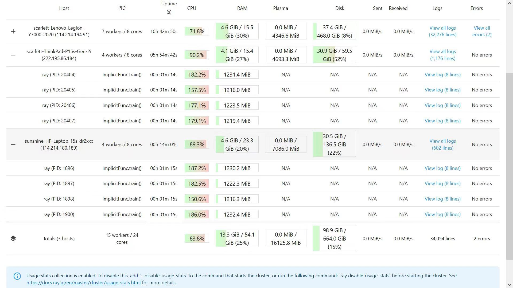
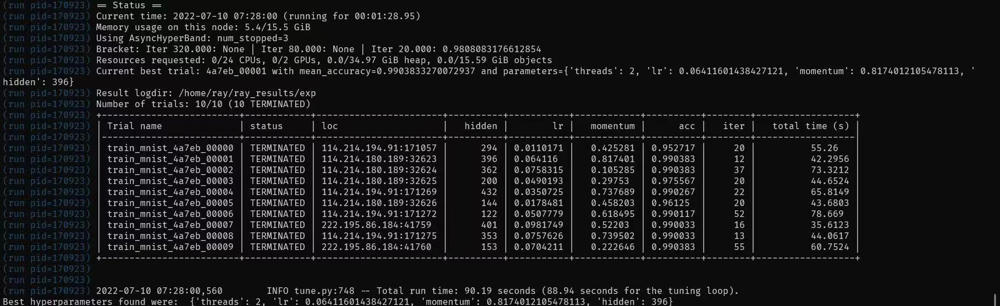
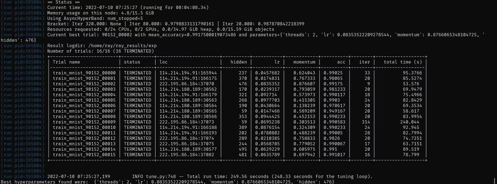
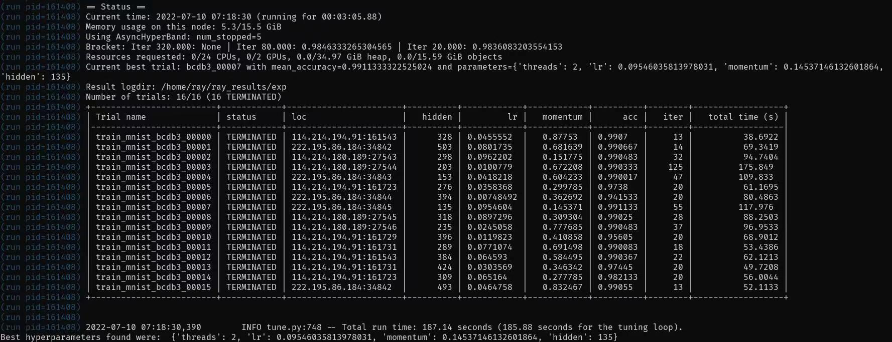

# lab4（性能测试和分析文档）

## 选定题目

我们选择的题目是分布式计算系统 Ray。

## 指标列表

衡量一个分布式计算系统优劣可以有如下 5 种指标：

* 程序响应时间

  一个优秀的计算系统应该能更快地响应程序。时间是给人最直观的衡量指标。

* 内存占用

  一台计算机的内存并非无限大，我们希望一个计算系统的内存占用尽可能地小，以节约存储成本。

* 带宽

  网络也是一项资源，节约网络带宽可以支持更多的算力加入系统。

* 机器间资源分配公平性

  我们希望一个优秀的分布式计算系统可以合理利用系统中的各机器资源，避免某台计算机总是被频繁的使用，另一些计算机从来不使用，导致系统的浪费，也加速设备的老化。

* 程序运行效果。

  我们在调用 Ray 的库时，希望这个库不仅满足资源占用较少，还希望它能运行出良好的结果，以达到程序运行的最初目的。

  本文中，程序运行效果特指 ray.tune 优化效果（ray.tune 优化率 = 达到所需的精度所需要的最大iter/ 达到所需的精度所需要的最大迭代次数（iter)，通过ray.tune尝试不同超参数的模型，分别测量达到0.99准确度所需的训练时间。我们希望使用ray找到合适的超参数，使得模型训练迭代次数最小（即收敛到指定准确率的迭代次数最小）。

在本次实验中。我们组选择了**程序响应时间**指标（即**时间**指标）与**程序运行效果**指标（即**训练效果**指标）。

## 分布式场景

### 初步性能测试

Ray Tune 是一个用来实验执行和超参数调优的 Python 包，其中集成了网格搜索、随机搜索、贝叶斯优化搜索（BayesOptSearch）等搜索算法以及 Optuna, Hyperopt 等优化工具。Ray Tune调参的模型可以是基于 PyTorch, XGBoost, TensorFlow 或 Keras 等框架构建的模型。由于它在机器学习方面极 为良好的兼容性，我们决定将我们的性能测试设计在机器学习的背景下，以下为我们的多台电脑所构成的分布式环境的一个展现。



我们使用 `tensorflow` 搭建了一个平常的神经网络，我们将训练的 `accuracy` 设定为 0.99，而后我们将 `ray.tune ` 使用到了我们的参数调节里面。具体情况如下：

```python
analysis = tune.run(
    train_mnist,
    name="exp",
    scheduler=sched,
    metric="mean_accuracy",
    mode="max",
    stop={"mean_accuracy": 0.99, "training_iteration": num_training_iterations},
    num_samples=10,
    resources_per_trial={"cpu": 1, "gpu": 0},
    config={
        "threads": 2,
        "lr": tune.uniform(0.001, 0.1),
        "momentum": tune.uniform(0.1, 0.9),
        "hidden": tune.randint(32, 512),
    },
)
```

我们对时间和训练效果进行了分析（以下均是基于我们的 `accuracy` 要求为 0.99）：



从**时间**的角度，可以看出我们的运行总时间是 90.19s。

从**训练效果**的角度，可以看出，其中我们到达所需的 `accuracy` 最小迭代次数（iter）为12，最大迭代次数为55。ray.tune 优化率为 4.58

### 性能优化 1

因为进行更多的尝试可以找到更好的参数，所以我们认为将 `num_samples` 从 10 改为了 16 可以提高 ray.tune 优化率。以下为我们的优化结果的截图：



经过了上述优化，从**训练效果**的角度分析，我们到达所需的 `accuracy` 最小迭代次数为9，最大为314，可以得出 ray.tune 优化率为 34.89。由于尝试次数变多，此项性能优化将 ray.tune 优化率提高到原来的 662%，与理论定性分析一致。

### 性能优化 2

观察发现，某些尝试的迭代次数显著高于其他尝试，在很大程度上降低了程序的运行效率。因为我们机器学习的核心算法在每个进程包含 2 线程时工作效率最高，所以为每个进程分配 2 个 CPU 比默认的 1 个 CPU 更优。在性能优化 1 的基础上，我们认为每个进程的 cpu 个数调到了 2 是一个可以显著提升程序执行时间效率的手段。以下为我们的优化结果截图：



从**时间**的角度分析，我们可以看出我们的运行总时间为187.14s。因为 `num_samples` 参数与每个进程 cpu 个数参数相互独立，所以 cpu 个数参数从 1 变到 2 可以提升时间性能 25.1%，与理论定性分析一致。
